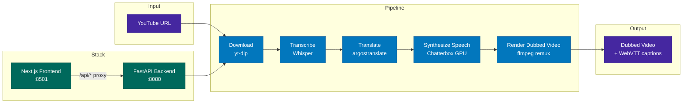

# Foreign Whispers

[](./LICENSE)

YouTube video dubbing pipeline — transcribe, translate, and dub 60 Minutes interviews into a target language.

## Architecture



## Quick Start

Two profiles are available via Docker Compose:

```bash
# NVIDIA GPU — Whisper + Chatterbox on dedicated GPU containers
docker compose --profile nvidia up -d

# CPU only — no GPU containers (STT/TTS must be provided externally)
docker compose --profile cpu up -d
```

Open **http://localhost:8501** in your browser.

## Pipeline Stages

| Stage | What it does | Output |
|-------|-------------|--------|
| **Download** | Fetch video + captions from YouTube via yt-dlp | `videos/`, `youtube_captions/` |
| **Transcribe** | Speech-to-text via Whisper | `transcriptions/whisper/` |
| **Translate** | Source → target language via argostranslate (offline, OpenNMT) | `translations/argos/` |
| **Synthesize Speech** | TTS via Chatterbox (GPU) or Coqui (CPU fallback), time-aligned to original segments | `tts_audio/chatterbox/` |
| **Render Dubbed Video** | Replace audio track via ffmpeg remux (no re-encoding) | `dubbed_videos/` |

Captions are served as WebVTT via the `<track>` element — no subtitle burn-in:

| Endpoint | Source | Output |
|----------|--------|--------|
| `GET /api/captions/{id}/original` | YouTube captions (generated on the fly) | — |
| `GET /api/captions/{id}` | Translated segments + YouTube timing offset | `dubbed_captions/*.vtt` |

## Project Structure

```
foreign-whispers/
├── api/src/                     # FastAPI backend (layered architecture)
│   ├── main.py                  # App factory + lazy model loading
│   ├── core/config.py           # Pydantic settings (FW_ env prefix)
│   ├── routers/                 # Thin route handlers
│   │   ├── download.py          # POST /api/download
│   │   ├── transcribe.py        # POST /api/transcribe/{id}
│   │   ├── translate.py         # POST /api/translate/{id}
│   │   ├── tts.py               # POST /api/tts/{id}
│   │   └── stitch.py            # POST /api/stitch/{id}, GET /api/video/*, /api/captions/*
│   ├── services/                # Business logic (HTTP-agnostic)
│   ├── schemas/                 # Pydantic request/response models
│   └── inference/               # ML model backend abstraction
├── frontend/                    # Next.js + shadcn/ui
│   ├── src/components/          # Pipeline tracker, video player, result panels
│   ├── src/hooks/use-pipeline.ts # State machine for pipeline orchestration
│   └── src/lib/api.ts           # API client
├── download_video.py            # yt-dlp wrapper
├── transcribe.py                # Whisper wrapper
├── translate_en_to_es.py        # argostranslate wrapper
├── tts_es.py                    # Chatterbox client + time-aligned TTS generation
├── translated_output.py         # ffmpeg audio remux + legacy subtitle compositing
├── pipeline_data/               # All intermediate and output files (volume-mounted)
│   └── api/
│       ├── videos/              # Downloaded source MP4s
│       ├── youtube_captions/    # Line-delimited JSON from yt-dlp
│       ├── transcriptions/
│       │   └── whisper/         # Whisper output JSON
│       ├── translations/
│       │   └── argos/           # argostranslate output JSON
│       ├── tts_audio/
│       │   └── chatterbox/       # TTS WAV files per config
│       ├── dubbed_captions/     # Target-language VTT
│       ├── dubbed_videos/       # Final dubbed MP4s per config
│       └── speakers/            # Reference voice clips
├── docker-compose.yml           # Profiles: nvidia, cpu, apple
├── Dockerfile                   # Multi-stage: cpu and gpu targets
└── docs/
    └── dubbing-alignment-design.md  # TTS temporal alignment literature survey + design
```

## API Endpoints

| Method | Endpoint | Description |
|--------|----------|-------------|
| POST | `/api/download` | Download YouTube video + captions |
| POST | `/api/transcribe/{id}` | Whisper speech-to-text |
| POST | `/api/translate/{id}` | Source → target language translation |
| POST | `/api/tts/{id}` | Time-aligned TTS synthesis |
| POST | `/api/stitch/{id}` | Audio remux (ffmpeg -c:v copy) |
| GET | `/api/video/{id}` | Stream dubbed video (range requests) |
| GET | `/api/video/{id}/original` | Stream original video (range requests) |
| GET | `/api/captions/{id}` | Translated WebVTT captions |
| GET | `/api/captions/{id}/original` | Original English WebVTT captions |
| GET | `/api/audio/{id}` | TTS audio (WAV) |
| GET | `/healthz` | Health check |

## Development

### Container architecture

```
Host machine
├── foreign_whispers/      ← bind-mounted into API container
├── api/                   ← bind-mounted into API container
├── pipeline_data/api/     ← bind-mounted into API container
│
└── Docker Compose
    ├── foreign-whispers-stt   (GPU)  :8000  — Whisper inference
    ├── foreign-whispers-tts   (GPU)  :8020  — Chatterbox inference
    ├── foreign-whispers-api   (CPU)  :8080  — FastAPI orchestrator
    └── foreign-whispers-frontend      :8501  — Next.js UI
```

The API container is CPU-only — it delegates all GPU work to the STT and TTS
containers via HTTP. The `foreign_whispers/` library and `api/` source are
**bind-mounted** from the host, so edits on the host are immediately visible
inside the container.

### Editing and debugging the library

1. **Start all services:**

   ```bash
   docker compose --profile nvidia up -d
   ```

2. **Edit any file** in `foreign_whispers/` or `api/` on the host (e.g. in VS Code).

3. **Restart the API container** to pick up changes:

   ```bash
   docker compose --profile nvidia restart api
   ```

   To avoid manual restarts, add `--reload` to the uvicorn command in
   `docker-compose.yml`:

   ```yaml
   command: ["uv", "run", "uvicorn", "api.src.main:app", "--host", "0.0.0.0", "--port", "8080", "--reload"]
   ```

   With `--reload`, uvicorn watches for file changes and restarts automatically.

4. **Test via the SDK** from a notebook or Python REPL on the host:

   ```python
   from foreign_whispers import FWClient
   fw = FWClient()             # connects to http://localhost:8080
   fw.transcribe("GYQ5yGV_-Oc")
   ```

5. **Test the library directly** (no Docker needed for pure-Python alignment work):

   ```python
   from foreign_whispers import global_align, compute_segment_metrics, clip_evaluation_report
   ```

   This is the two-phase workflow:
   - **Phase 1 (SDK):** Call `FWClient` methods to drive the pipeline through Docker (download, transcribe, translate, TTS, stitch). Data lands in `pipeline_data/api/`.
   - **Phase 2 (library):** Import `foreign_whispers` directly to iterate on alignment algorithms using data produced in Phase 1. No GPU or Docker needed.

### Local setup (no Docker)

```bash
uv sync                    # install all dependencies
uv run python -c "from foreign_whispers import FWClient; print('ok')"
```

For Jupyter/VS Code notebooks, register the kernel once:

```bash
uv pip install ipykernel
uv run python -m ipykernel install --user --name foreign-whispers
```

Then select the **foreign-whispers** kernel in VS Code's kernel picker.

### When to rebuild

| Change | Action needed |
|--------|--------------|
| Edit `foreign_whispers/*.py` or `api/**/*.py` | Restart API container (or use `--reload`) |
| Edit `pyproject.toml` / add dependencies | `docker compose --profile nvidia build api && docker compose --profile nvidia up -d api` |
| Edit `frontend/` | Frontend has its own hot-reload; no action needed |
| Edit `docker-compose.yml` | `docker compose --profile nvidia up -d` (re-creates changed services) |

### File ownership

The API container runs as your host UID/GID (set in `.env`), so all files it
creates in `pipeline_data/` are owned by you — not root. If you see permission
errors on existing files, they were created by an older root-mode container:

```bash
sudo chown -R $(id -u):$(id -g) pipeline_data/
```

### Frontend

```bash
cd frontend && pnpm install && pnpm dev
```

### Requirements

- Python 3.11
- ffmpeg (system-wide)
- deno (for yt-dlp YouTube extraction)
- NVIDIA GPU recommended for Whisper + Chatterbox inference
- For Apple Silicon adaptation see APPLE_SILICON_ADAPTATION_SUMMARY.md

### Key Implementation Strategies

#### Phased evolution (`notebooks_vanilla` → `notebooks`)

`notebooks_vanilla/` is the unmodified course baseline; `notebooks/` is the
working set. Diffing the two trees (`diff -rq notebooks_vanilla notebooks`)
shows what changed — every stage notebook now ships with a `NOTES.md`
walkthrough, the `.ipynb` cells were rewritten to reflect the per-stage
fixes, and the cached `.png` plots were regenerated from the new pipeline
output. Three concrete phases:

**Phase 1 — Single-voice TTS.**
*Notebook:* `tts_integration`.
The first end-to-end dub. Translation → Chatterbox → ffmpeg remux all
worked, but every speaker in the source video came out in *one* canned
voice — the `voice_map` parameter wasn't being threaded through and the
client never enrolled per-speaker reference WAVs. The dub was
intelligible but indistinguishable from the vanilla baseline.

**Phase 2 — Diarization + per-speaker cloning, with three latent bugs.**
*Notebooks:* `diarization_integration`, `tts_integration` (Task 5).
Added pyannote `speaker-diarization-3.1` between transcribe and
translate; `assign_speakers` merges labels into segment JSON; TTS
endpoint builds a `voice_map` from `pipeline_data/speakers/<lang>/`
and forwards `speaker_wav` per segment to Chatterbox. Per-speaker
voices started landing — but three bugs stayed hidden until repeated
runs:

  - **Memory leak (~85 GB on a 3-min video).** `Pipeline.from_pretrained`
    was called inside `diarize_audio` on every request; the MPS caching
    allocator never shrinks, so each call leaked ~1 GB of pyannote
    state and Whisper word-timestamp attention slabs piled up alongside.
  - **Audio offset drift (1–2 s late).** `resegment_by_speaker_turns`
    threw away Whisper's per-word timestamps, which meant `/diarize`
    re-ran Whisper-with-words on every call *and* corrupted the
    timing reference used by the alignment stage.
  - **"Sound dies after the opening".** `ChatterboxClient` used a 60 s
    HTTP read timeout, but a 200-char Spanish segment takes 60–120 s
    on MPS; with 3 concurrent workers queueing on a single GPU,
    29 of 31 segments timed out from the API's view (the server kept
    rendering audio nobody was listening for) and were padded with
    silence.

**Phase 3 — Bounded RAM, correct timing, clean audio.**
Singleton pyannote pipeline + `torch.mps.empty_cache()` + `gc.collect()`
after each Whisper call (RSS plateaus at ~4 GB across repeated runs vs
the 85 GB leak); `resegment_by_speaker_turns` preserves `words` so the
re-segmentation is one-shot; `CHATTERBOX_READ_TIMEOUT=600` and
auto-clamping `FW_TTS_WORKERS=1` for a localhost Chatterbox stop the
silence dropouts. Verification via `scripts/verify_dubbed_video.py`
(silero-VAD onset delta + ECAPA-TDNN top-1 speaker accuracy) reports
**0.0 s onset delta**, **31/31 segments populated**, and **31/31
speaker labels matching their reference embedding** on the dubbed audio.
Remaining limitations: cross-lingual voice cloning (English reference →
Spanish output) keeps the cloned voice timbre slightly off the original
speaker — recognisable but not photoreal — and short turns (<2 s) still
occasionally land on the wrong centroid. Both are model-level issues
rather than pipeline bugs.

**Phase 4 — Multi-video runs and Chatterbox watchdog.**
Going from one video to the full `video_registry.yml` surfaced two
operational issues invisible in single-video testing:

  - **Speaker references are per-language, not per-video.**
    `pipeline_data/speakers/<lang>/SPEAKER_NN.wav` is a single global
    namespace, and `scripts/extract_speaker_voices.py` overwrites it on
    every run. A second video would silently reuse the previous video's
    voices for cloning. Fix: back up the freshly-extracted refs to
    `pipeline_data/speakers/<lang>/<video_id>/` after each extraction so
    nothing is lost when the next video clobbers the global slots.
    Restoring is one `cp`.
  - **Chatterbox-MPS can die mid-run on long videos.** The Alysa Liu
    interview (4 speakers, 157 segments) hit a server crash partway
    through; the API kept POSTing and got `Connection refused` for every
    subsequent segment, padding 57/157 segments with silence. The
    in-process `requests`-side timeout fix from Phase 3 doesn't help if
    the *server* is gone. Fix: a tiny shell watchdog that polls
    `/health` every 30 s and re-invokes `./scripts/dev.sh start
    chatterbox` when down. With the watchdog in place the next video
    (Rob Reiner — 8 speakers, 144 segments, 39-min TTS) ran clean
    end-to-end with **0/144 silent segments**.

Final scorecard across the three processed videos:

| Video                | Speakers | Segs | Onset Δ | Speaker acc (dub) | Silent |
| -------------------- | -------: | ---: | ------: | ----------------: | -----: |
| Strait of Hormuz     |        3 |   31 |  0.00 s |              100% |   0/31 |
| Alysa Liu (pre-fix)  |        4 |  157 | +0.10 s |             68.4% | 57/157 |
| Rob Reiner (w/watch) |        8 |  144 | -0.10 s |             90.5% |  0/144 |